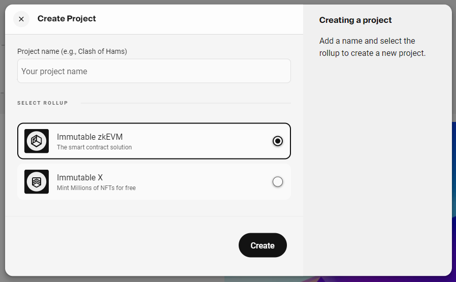
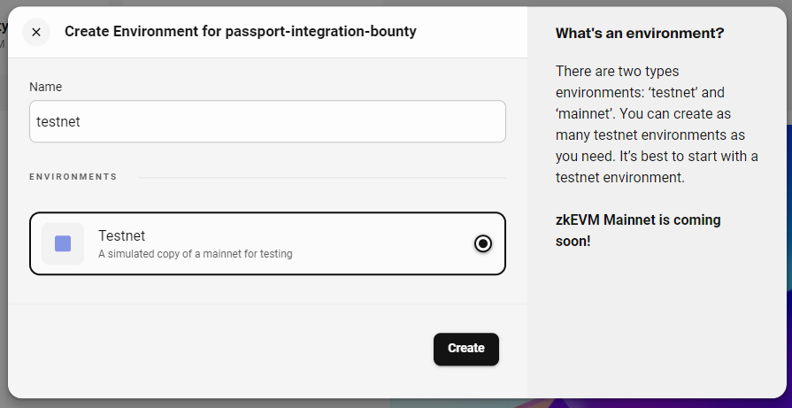
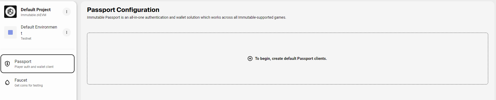
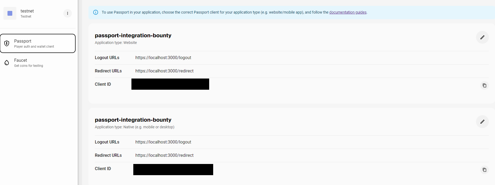
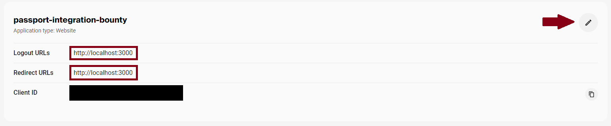

# Immutable Passport Integration

Step by step guide to integrate passport in your Next.js application

## Register the Application on Immutable Developer Hub

- Login to [Immutable Developer Hub](https://hub.immutable.com/)

- Click on "Add Project" button and fill in project name to get started. We will select "Immutable zkEVM" as our rollup.


- Create a testnet environment for your project.


- In project dashboard, click on create passport default client


- Default clients will be created as shown below


- For our demo, please update configuration for Website application to as follows:


## Clone the repo

- Clone this repo

- Open `demo-app` folder

- Check version of node. Make sure it is `v20.9.0`
```sh
node -v
# should print v20.9.0
```

- Install dependencies
```sh
npm install
```

- Create .env file by copying .env.example and update values with Passport Configuration for Website from the previous step
```sh
cp .env.example .env
```

- To start the application run the following command and visit `http://localhost:3000` in your browser
```sh
npm run dev
```

## Installing and Initialising the Passport Client

- Install Immutable SDK
```sh
npm install -D @imtbl/sdk
```

- Import Immutable SDK in `app/page.jsx` (Tips: search for TODO 1)
```js
// TODO 1: Import Immutable SDK
import { config, passport } from '@imtbl/sdk';
```

- Initialise passport instance in `app/page.jsx` (TODO 2)
```js
// TODO 2: Instantiate Passport instance
const _passportInstance = new passport.Passport({
  baseConfig: new config.ImmutableConfiguration({
    environment: config.Environment.SANDBOX,
  }),
  clientId: process.env.NEXT_PUBLIC_IMMUTABLE_CLIENT_ID,
  redirectUri: process.env.NEXT_PUBLIC_IMMUTABLE_REDIRECT_URL,
  logoutRedirectUri: process.env.NEXT_PUBLIC_IMMUTABLE_LOGOUT_URL,
  audience: 'platform_api',
  scope: 'openid offline_access email transact'
});
setPassportInstance(_passportInstance);
setPassportProvider(_passportInstance.connectEvm());
```

## Logging In A User with Passport

- log user in via passport [doc](https://docs.immutable.com/docs/zkEVM/products/passport/identity/login)
```js
// TODO 3: Log in user
await passportProvider.request({ method: "eth_requestAccounts" });
```

- configure the login callback. The `loginCallback` method will then process the response from the Immutable's auth domain, store the authenticated user in session storage and close the pop-up. Once the authentication flow is complete, the Promise returned from requestAccounts will also resolve with a single-item array containing the user's address.
```js
// TODO 4: Configure login callback
_passportInstance.loginCallback();
```

## Displaying The ID Token, Access Token, User's Nickname

- get user info and update state (TODO 5) [docs](https://docs.immutable.com/docs/zkevm/products/passport/identity/user-info/)
```js
// TODO 5: Get user info
passportInstance.getUserInfo().then(setUserInfo);
```

- get user JWT tokens and update state (TODO 6) [docs](https://docs.immutable.com/docs/zkEVM/products/passport/identity/jwt#how-to-get-jwts)
```js
// TODO 6: Get user JWT
passportInstance.getAccessToken().then(setAccessToken);
passportInstance.getIdToken().then(setIdToken);
```

## Logging Out A User

- log user out (TODO 7) [docs](https://docs.immutable.com/docs/zkEVM/products/passport/identity/logout)
```js
// TODO 7: Log out user
await passportInstance.logout();
```

## Initiate A Transaction from Passport

- install ethers
```sh
npm i ethers
```

- import ethers (TODO 8)
```js
// TODO 8: Import ethers
import { ethers } from "ethers";
```

- initiate a transaction (TODO 9)
```js
// TODO 9: Initiate a Transaction From Passport
const provider = new ethers.providers.Web3Provider(passportProvider);
const signer = await provider.getSigner();
const contract = new ethers.Contract(
  process.env.NEXT_PUBLIC_SC_ADDRESS,
  ["function saveMessage(string calldata _content)"],
  signer
);
await contract.saveMessage("Hello world!");
```

